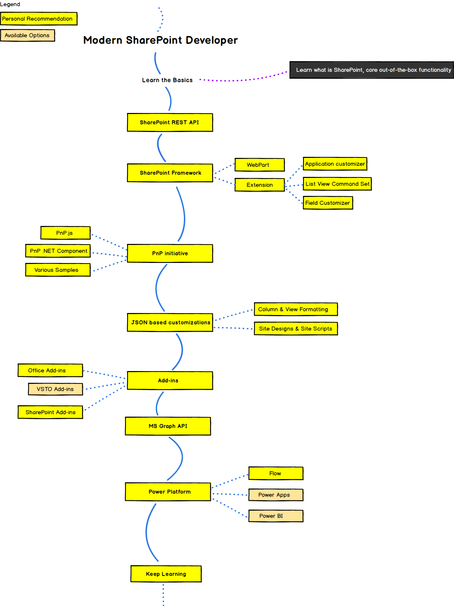

# Modern SharePoint developer roadmap

Inspired by awesome [developer roadmap](https://github.com/kamranahmedse/developer-roadmap).   

# Disclaimer
> The purpose of this roadmap is to give you an idea about all possible learning options in the area of modern SharePoint development.    
> Consider below points before going deeper in the roadmap below:
>  - It's not an official nor recommended roadmap by Microsoft, it's based completely on my opinion and vision
>  - It focuses on SharePoint Online only (and touches some Office 365 features as well), some features are still applicable for on-premises SharePoint, however on-premises SharePoint is not in focus of this roadmap (thus the name is "Modern")

## Roadmap

